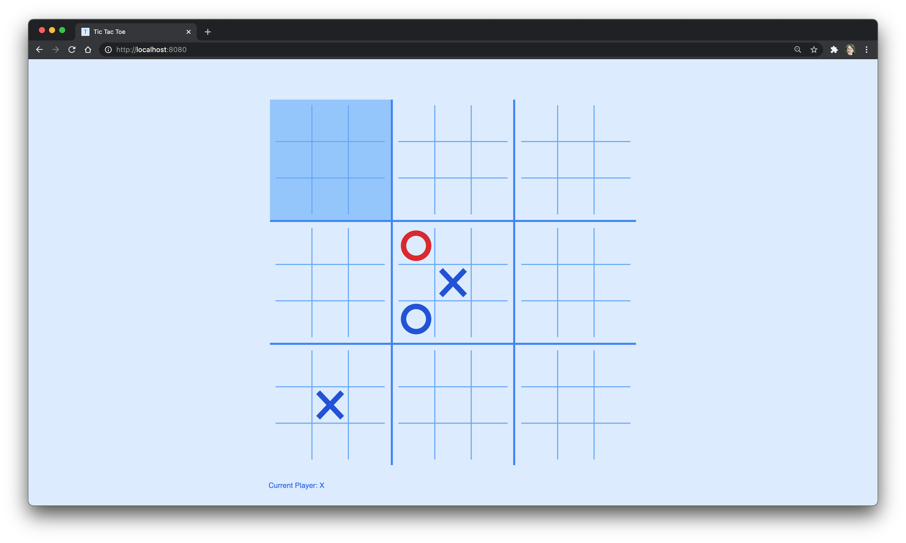

# Ultimate Tic Tac Toe

[Ultimate Tic Tac Toe Wikipedia](https://en.wikipedia.org/wiki/Ultimate_tic-tac-toe)

### Objective

Create a browser-based version of Ultimate Tic Tac Toe using Svelte and Sass. Currently the game is unplayable. I have been able get the board drawn based on data including the smaller local boards. I am currently working on the data model and making it packable to send over the internet using sockets.io.

This project is ongoing and there is no perfect end goal in mind. Basically, if I want to learn a new technology, I'll try to incorporate it into this project (i.e. Sass, networking using socket.io, etc.)

### Current Task

Get the game mechanics working. It technically works but I don't like how the data model is handled. I'm rewriting it to simplify how the game state is stored.

### Planned Features

Online play using socket.io
Room auth so users can send a game invite code to a friend
AI for playing by yourself

### Technologies Used

- Svelte
- Lodash
- SCSS
- Snowpack

# Snowpack

> ✨ Bootstrapped with Create Snowpack App (CSA).

## Available Scripts

### npm start

Runs the app in the development mode.

Open http://localhost:8080 to view it in the browser.

The page will reload if you make edits.

You will also see any lint errors in the console.

### npm test

Launches the test runner in the interactive watch mode.

See the section about running tests for more information.

### npm run build

Builds a static copy of your site to the `build/` folder.

Your app is ready to be deployed!

**For the best production performance:** Add a build bundler plugin like [@snowpack/plugin-webpack](https://github.com/snowpackjs/snowpack/tree/main/plugins/plugin-webpack) or [snowpack-plugin-rollup-bundle](https://github.com/ParamagicDev/snowpack-plugin-rollup-bundle) to your `snowpack.config.json` config file.

### Q: What about Eject?

No eject needed! Snowpack guarantees zero lock-in, and CSA strives for the same.
